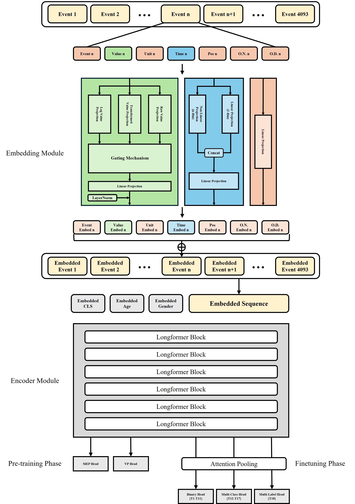

  <h1 align="center">PULSE-ICU: A Pretrained Unified Long-Sequence Encoder for Multi-task Prediction in Intensive Care Units
</h1>
 

    <a>Sejeong Jang</a>
    &nbsp;·&nbsp;
    <a>Hyo Kyung Lee</a>

  
   
  
    <b>DAHS Lab</b> · Data Analytics & Healthcare Systems Laboratory 
    Korea University
  

 

  

